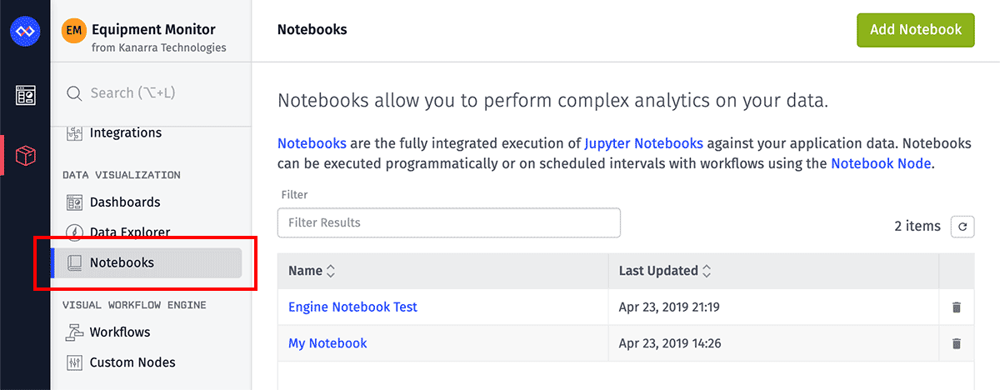

# Losant Notebook Examples

[Losant Notebooks](https://docs.losant.com/notebooks/overview/) are the fully integrated execution of [Jupyter Notebooks](https://jupyter.org/index.html) against your application data. With Notebooks, you can perform sophisticated batch analytics on historical datasets to derive entirely new kinds of insights.

## Example Notebooks

- [Debug Notebook](/debug-notebook/Debug.ipynb) - Think something is wrong with Notebooks? To verify that everything is working on Losant's end, we create this debug notebook that you can use to help isolate the problem.
- [Writing Guide](/writing-guide/writing-guide.ipynb) - In the docs, there is the [Notebook Writing Guide](https://docs.losant.com/notebooks/notebook-file/writing-guide/) that provides a lot of helpful information you should keep in mind while building notebooks.
- [Processing Motion Data](/process-motion/process_motion.ipynb) - Occupancy monitoring within smart environments has been a popular use case for our enterprise customers. Here is an example notebook that is used to generate a useful dataset of the most active or least active times of the conference rooms in the Losant Smart Office.